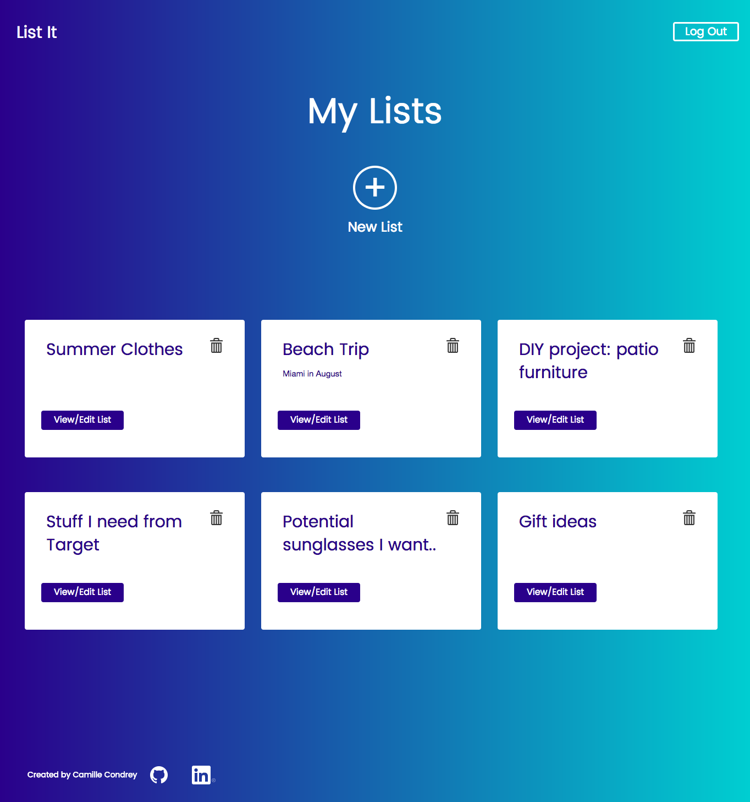
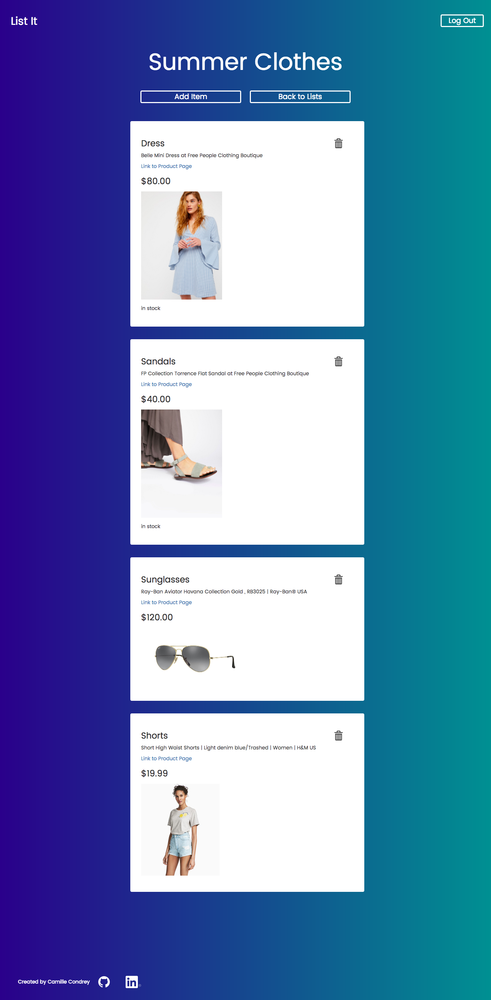

List It.

-----

App description: 

If you're like me and you love to shop but don't always have the funds to buy everything at once, List It can help you keep track of the items you'd like to buy until you're ready to buy them. 

Users can create as many lists as they'd like from their profile page and add items to those lists from the individual list page. Items only require a name, but can also include an item description, price and a link to the product if it exists online. Every link that is added to an item is scraped for meta data that may include an image of the product, a product description, and whether the item is currently in stock or not. If the website provides that specific meta data, it will be added to the item automatically. 

Development Roadmap:

Moving forward, I would like to implement a sharing feature to this site, so that users can mark which lists they would like to make public, and share those with others as a wish list that people can use to buy gifts for the user. It would be ideal to have a browser extension feature that would allow users to "List It" on products they see while shopping around the internet in addition to being able to manually save them to their collection. 

Screen Shots: 

Technologies used: 

Built using: Node.js/Express/Mongoose

Database: MongoDB

Authentication: Passport.js

Client Side: Javascript, jQuery, HTML, CSS, Bootstap

html-metadata: to scrape MetaData from links

